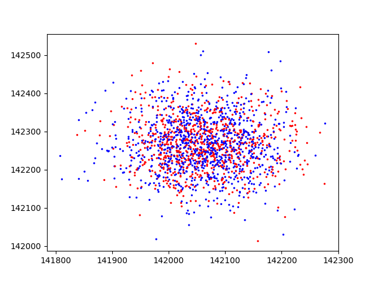
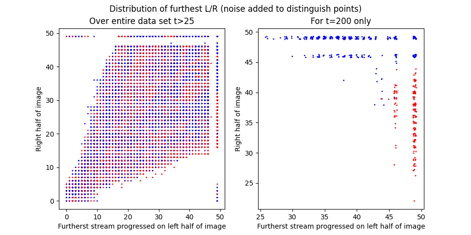
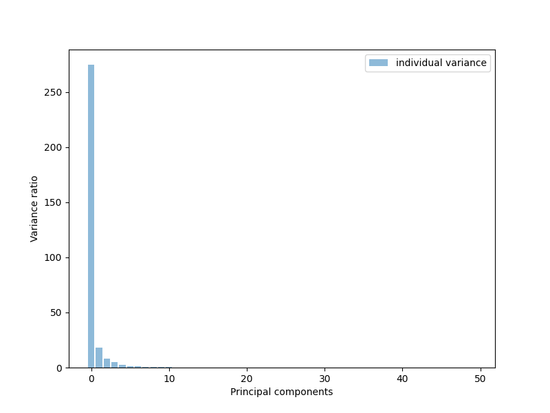
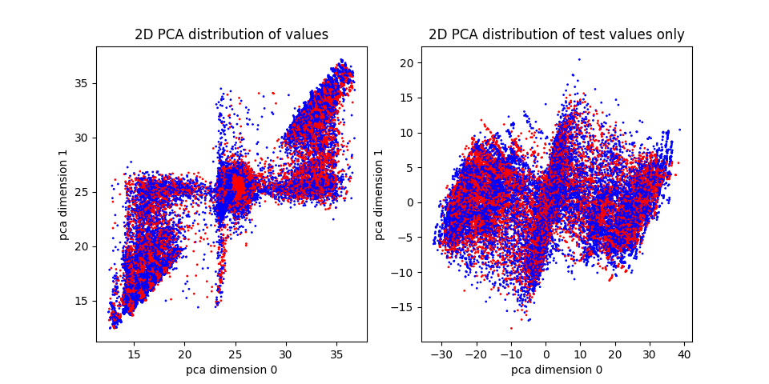

# Paper

Method:
- Mathematical simulation of flow and erosion
    - Randomised initial volume sections
    - Evolving according to ---- equations
- Train different models on the simulated data with different parameters

Analysis:
- Model 1: simple models
    - Distribution of sum of left/right volume fractions
    - Clustering algorithms show no siginificant clustering
    - Clustering v time or channel progression (incomplete)
- Model 2: classical models, specifically a random forest or decision tree
    - Different extractions of feature
- Model 3: neural methods
    - CNN on independent images, GRU on time series
- All 3: quality of predictions v time / channel progression

Discussion:
- Compare the 3 approaches and many trained models
    - Metrics
    - Caveats around the metrics and under what conditions to interpret

# Outline

## Background

- Trying to analyse flow and erosion
- Do so with simulations in the lab

_picture of physical experiments_

- For ease of analysis, build a mathematical model of erosion
    - _overview of mathematics behind the model_
    - Start with randomised volume fractions over a grid
    - Parameters include flow rate, ramp rate, etc
    - Tweak where the entrance/exit points are for different behaviours

## Methods

### Manually extracting features

- Start with the simplest feature - can we determine by summing up volume fractions
  on left/right side of the system and determine if that's left or right?
    - Simplest parameters - low flow and ramp rate, only goes left/right
    - Generate set of `n=2000` simulations
    - For each simulation, take `t=0` image and divide into left and right half
    - Simply sum up the pixel intensities (and thus volume fraction) of each half
    - Results in 2-tuple of `(left-sum, right-sum)`
    - Plot the tuples on 2d graph, coloring points red/blue depending on if the
      stream went left or right
    - 
    - The same but for t=200 when system is done with evolving
    - 
    - By visual inspection, we can see that there's no kind of clustering algorithm
      that will function well
    - Confirmed by training a naive bayes classifier, `accuracy=0.53`
- Next feature: split image into two half, and for each half, determine the furthest
  row where the channel has progressed
    - Scan each row for at least 2 pixels that fall below a `threshold=50`
    - Once again, tuple of `(left-row, right-row)`
    - 
- Next feature: determine the "centre" of the stream
    - Calculate by $$ \frac{(\max(row) - row) * range(1,50)}{\sum row} $$
    - Get a 50-tuple specifying the "centre" of the stream at that row
    - Train a decision tree, but couldn't find a configuration that doesn't overfit
    - 50-tuple has a high degree of colinearity, likely the reason for overfitting
    - 

### PCA

- Continuing from the dataset of "centre" of stream, instead of all 50 features,
  use PCA to reduce down to `n=7` features
    - Visualisation of PCA with `n=2` features
    - 
    - Components: 
```
>>> pca.components_
array([[-3.07005392e-01, -2.64534298e-01, -3.76518156e-01,
        -3.64752211e-01, -3.58203712e-01, -3.09247874e-01,
        -2.65697451e-01, -2.33220231e-01, -2.08803276e-01,
        -1.84980910e-01, -1.64892092e-01, -1.47334811e-01,
        -1.33329873e-01, -1.18318285e-01, -1.06748398e-01,
        -9.51474027e-02, -8.55109910e-02, -7.77158787e-02,
        -6.64151818e-02, -6.05021258e-02, -5.51970037e-02,
        -4.73766450e-02, -4.24024416e-02, -3.72186860e-02,
        -3.15750719e-02, -2.65668593e-02, -2.29471216e-02,
        -1.92443203e-02, -1.55391519e-02, -1.16753477e-02,
        -9.21626555e-03, -5.74997642e-03, -6.44180220e-03,
        -4.59949534e-03, -2.80885690e-03, -2.13192955e-03,
         2.50975218e-03, -1.15337852e-03, -1.55615042e-03,
         8.68834874e-04, -6.11890723e-04, -5.21313157e-04,
        -2.00173550e-03,  4.43526233e-05, -1.03230091e-03,
        -1.35399380e-03, -1.51546471e-03,  2.10369116e-04,
        -7.85080159e-04, -7.19963748e-04],
       [ 2.37375657e-01,  1.87854834e-01,  2.13890586e-01,
         2.14288001e-01,  1.50448453e-01,  5.11580006e-02,
        -2.01974300e-02, -7.48915819e-02, -1.15387012e-01,
        -1.38783347e-01, -1.67979882e-01, -1.90249448e-01,
        -2.09587133e-01, -2.23350967e-01, -2.34547153e-01,
        -2.33506466e-01, -2.31182508e-01, -2.37140992e-01,
        -2.23750675e-01, -2.24780052e-01, -2.13600949e-01,
        -1.93842617e-01, -1.83521882e-01, -1.73377728e-01,
        -1.59682816e-01, -1.38611321e-01, -1.33044373e-01,
        -1.22434383e-01, -1.08490036e-01, -9.90198518e-02,
        -8.22766454e-02, -6.90179361e-02, -6.08488037e-02,
        -5.59469648e-02, -4.90573394e-02, -3.61417227e-02,
        -2.81715822e-02, -2.54513511e-02, -2.31628859e-02,
        -1.03003868e-02, -1.03954450e-02, -1.42202208e-02,
        -2.14060752e-02, -1.81127499e-02, -2.06287720e-02,
        -2.33959204e-02, -2.05423780e-02, -2.57149014e-02,
        -2.82348033e-02, -2.80531636e-02]])
```
    - As expected, components weighed more towards the top of the image (since
      the 0th element represents the top row here)
- Simple experiment: what if we train an ordinary least squares model on 2D PCA
    - Still using clean data with streams going only left/right
    - Convert continuous prediction to discrete with `threshold=0.5` (if
      `prediction > 0.5`, then `prediction=1`)
    - Accuracy `0.56`


### CNN

- Architecture is an adapted form of VGGNet
- 2 Conv2D -> 2 Dense (64) -> Output layer with 2 nodes
- Nodes represent confidence in stream going left/right (2-tuple of `(confidence go left, confidence go right)`)
- Doesn't have to sum to 1 since data contains instances where it goes to both
- Since output is a 2-tuple, we can plot it on a 2D graph
- Take all the simulations, select only `t=1`, and plot all the predictions:

- Same, but for `t=200` only:

- As expected, predictions start from the middle of 50/50 and diverges into
  the corners with higher levels of confidence
- Define an "overall level of confidence" by taking the prediction (a 2-tuple
  with `(confidence left, connfidence right)`) and taking the distance of that
  point to `(0,1), (1,0), (1,1)`, which represent 100% confidence is a prediction
  and taking the minimum of the three distances.
- Plot of average minimum distance vs time:

- Instead of normalising against time, normalise against how far the stream
  has travelled (out of 50 in below example)


### RNN
