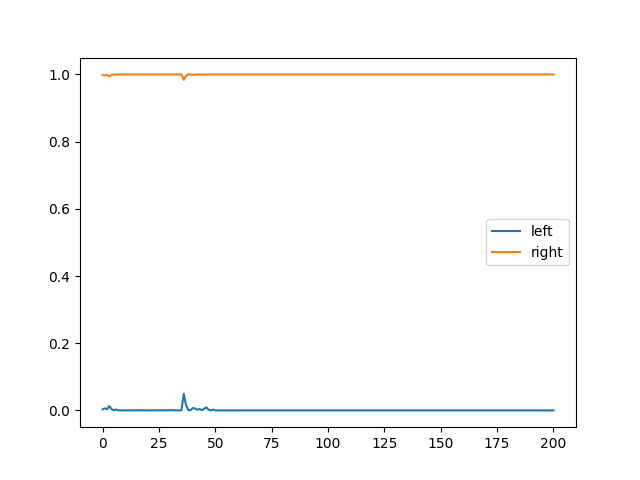
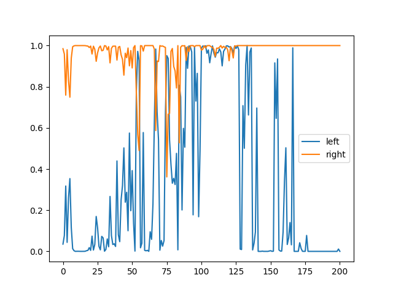
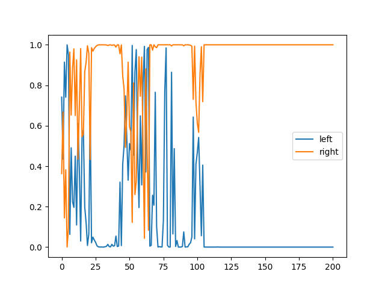
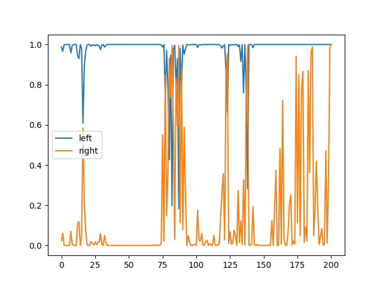
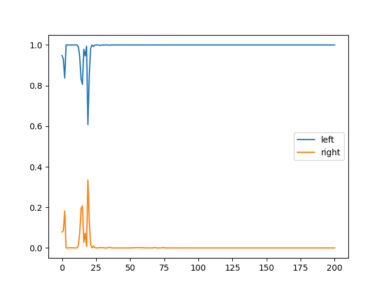
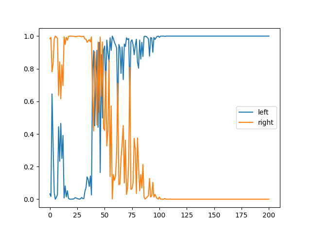
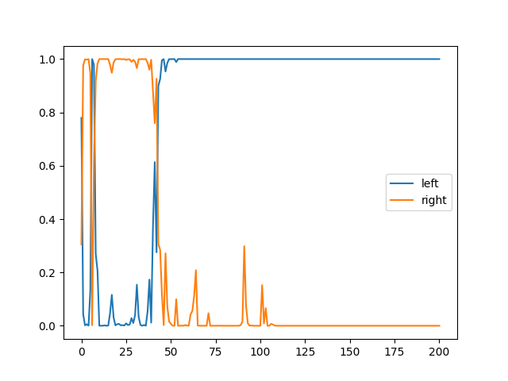
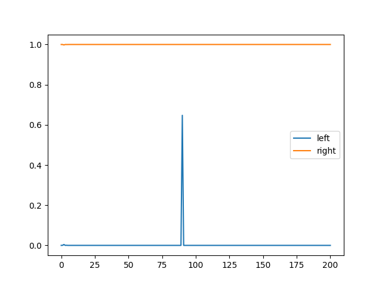
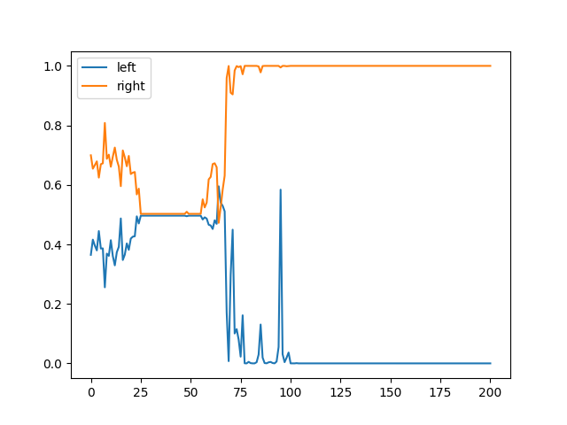

# Physics Erosion and ML

# Week 16

 - Built new model with 2000 simulations as training set, 200k data points
 - Good acc/loss: 97.87/0.03
 - But looks like severe overfitting (but this is a fresh dataset), but
   generalises well to new data

## Figures

