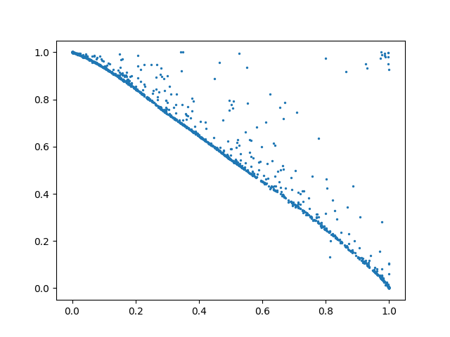
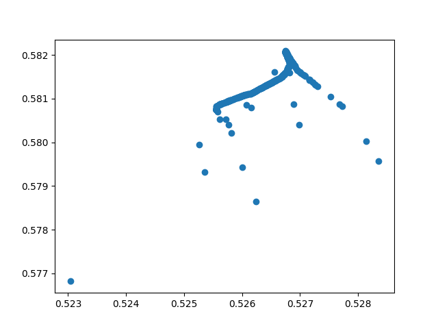
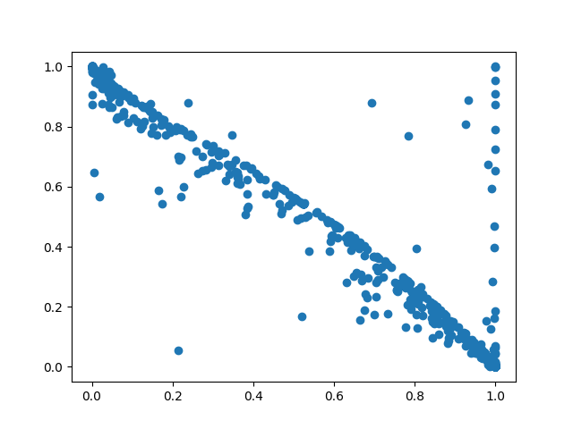
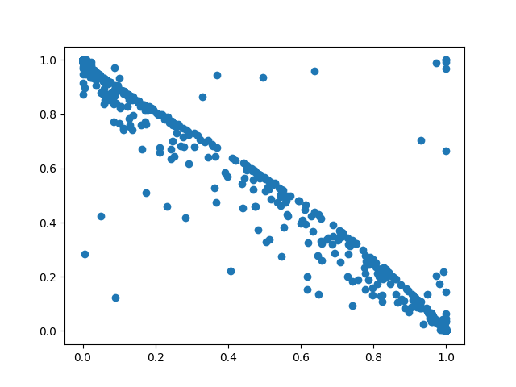
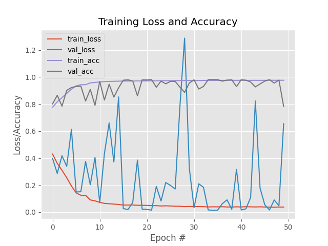

# Week 17

## Questions

1. Probability of initial image predicting final outcome
2. Does sum of left/right correctly predict outcome
3. Distribution of convergence point of classifier
4. Only had access to bottom half of image, probabilities then
5. Treat data as time series (convolution with temporal dimension

## Q1: Probability of initial image predicting final outcome

Old model, first only on test set:

Train brand-new model on just first image (left/right only):

So initial impression of model's accuracy early on was mistake, only works on
a few examples, as dots don't really cluster anywhere. Look at initial model
predictions on testing data first only:

## Q2: Does sum of left/right predict outcome?

No.

## Q4: Only bottom half

