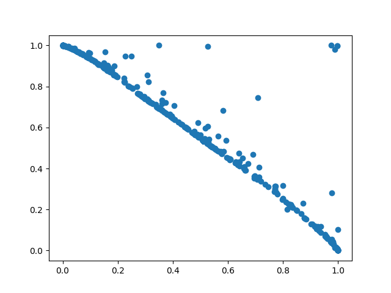
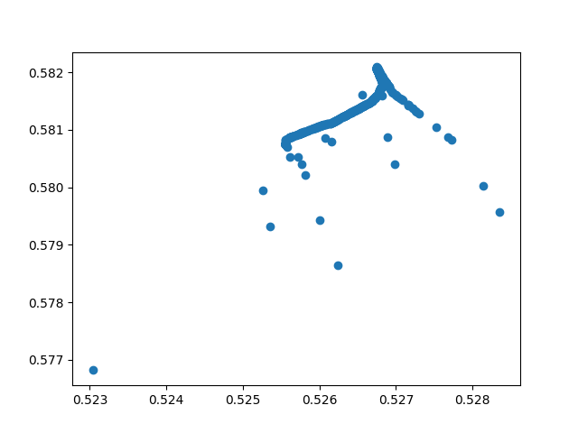
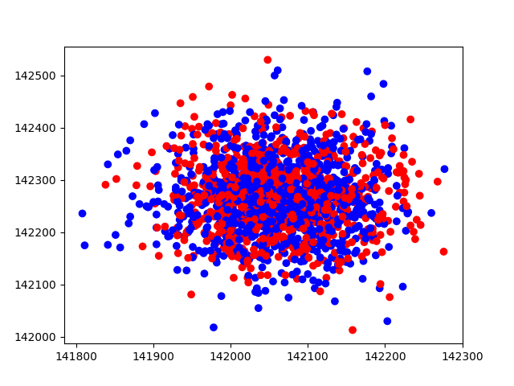

# Week 17

## Questions

1. Probability of initial image predicting final outcome
2. Does sum of left/right correctly predict outcome
3. Distribution of convergence point of classifier
4. Only had access to bottom half of image, probabilities then
5. Treat data as time series (convolution with temporal dimension

## Q1: Probability of initial image predicting final outcome

Old model evaluations in simulations 2001-2500:

Training data (1-2001):

Train brand-new model on just first image (left/right only):

So initial impression of model's accuracy early on was mistake, only works on
a few examples, as dots don't really cluster anywhere.

## Q2: Does sum of left/right predict outcome?

## Q3: WIP

## Q4: WIP