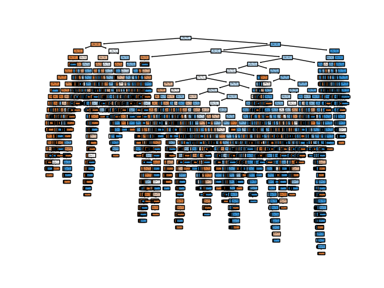

# Week 26 - Classical Algorithms and Manual Models

Trained classical algorithms, using following parameters:
- Clean data only, only left/right
- Low flow rate and ramp rate
- Only t>25

Using the following features:
1. Tuple of (sum of all pixels on left half of image, same for right half)
2. Split image into two halves, find the highest row on each half where the
  channel has progressed (more than 1 pixel below a certain threshold)
3. Split image into 50 rows, for which we take the "weighted average" of the channel
  center. This is done by taking 1 - the value of each pixel and treating that
  as a distribution over which we take the weighted average

The results were:
- #1 acheived 53% accuracy with both naive bayes and k-nearest neighbour models
    - Initial naive testing saw over 90% accuracy, probably overfitting
    - Resolved by aggressive normalisation and reducing amout of input data
- #2 with naive bayes has 65%
    - Same issue as #1, wasn't sure if overfitting or underfitting is still a problem
    - Didn't spend much time investigating, move on to #3
- #3 with decision tree had 86%

Further questions
- Suspected overfitting for decision tree, since it is uncannily high
    - Try a random forest instead
    - Also further split out training and testing data
- Try to get a comparable figure for model accuracy with the CNN
    - Also see if the CNN confidence levels are well-calibrated
- Document all these things
    - Push to Github
    - Add as submodule to gitlab(?)
